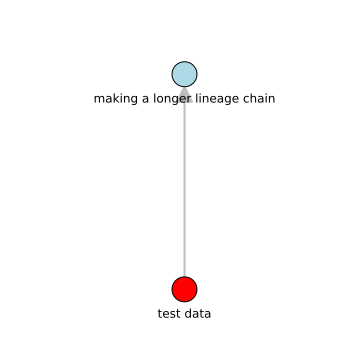
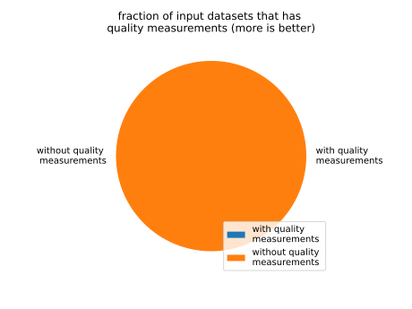

test data
=========

# description
  
a test dataset
## keywords

||
| :--- |
|[test](iu34jkAWD.md)|
|[catalog](sdfjlhgfvrkhlsfd.md)|

## Status

acceptence
## Publisher

|||
| :--- | :--- |
|Publisher|SimpleMDDataCatalog|
|Contact|jdoe@example.com|

## About the data

|||
| :--- | :--- |
|last modified|2024-10-15|
|spatial cover|EU|
|temporal cover|2010 - 2010|
|version|1.0.0|

## Data lineage

|was derived from|
| :--- |
|[making a longer lineage chain](vgsgr.md)|
  

## License

https://creativecommons.org/licenses/by/4.0/
## Distributions

|identifier|format|version|last modified|access url|
| :---: | :---: | :---: | :---: | :---: |
|23456|excel|0.1.0|2024-10-15|[https://www.example.com/test.xslx](https://www.example.com/test.xslx)|
|None|None|None|None|[None](None)|

## Data Quality

|metric|value|time of evaluation|dimension|
| :---: | :---: | :---: | :---: |
|[number of records](mwqd83k93k.md)|275937600.0|2024-11-19T14:46:51+0000|https://iso25000.com/index.php/en/iso-25000-standards/iso-25012/Completeness|

## supply chain analysis
  
