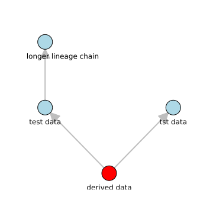
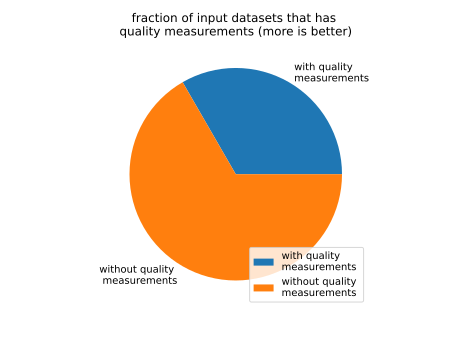

derived data
============

# description
  
a test dataset to see if we can get lineage right
## keywords

||
| :--- |
|[lineage](fdcshjnfdscahjn.md)|
|[catalog](sdfjlhgfvrkhlsfd.md)|

## Status

test
## Publisher

|||
| :--- | :--- |
|Publisher|jane doe|
|Contact|jane@example.org|

## About the data

|||
| :--- | :--- |
|last modified|2024-10-17|
|spatial cover|France|
|temporal cover|2011|
|version|0.3.3|

## Data lineage

|was derived from|
| :--- |
|[test data](12345.md)|
  

## License

https://opensource.org/licenses/Apache-2.0
## Distributions

|identifier|format|version|last modified|access url|
| :---: | :---: | :---: | :---: | :---: |
|94759|https://avro.apache.org/docs/1.12.0/|4.5.1|2024-10-17|[https://www.example.org/lineagetest.avro](https://www.example.org/lineagetest.avro)|

## Data Quality

|metric|value|time of evaluation|dimension|
| :---: | :---: | :---: | :---: |
|[response time](kd84jsd8wksyf.md)|5.46|2024-10-19T14:46:01+0000|https://iso25000.com/index.php/en/iso-25000-standards/iso-25012/Availability|
|[fraction of compliant records](ja9EJDS8E.md)|0.975|2024-10-19T14:46:51+0000|https://iso25000.com/index.php/en/iso-25000-standards/iso-25012/Compliance|

## supply chain analysis
  
