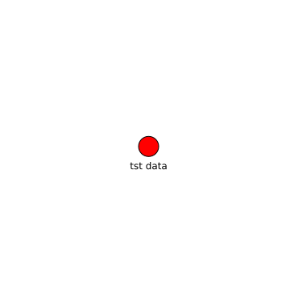

tst data
========

# description
  
another test data set
## keywords

||
| :--- |
|[wind](fajfafl.md)|
|[lineage](fdcshjnfdscahjn.md)|

## Status

unknown
## Publisher

|||
| :--- | :--- |
|Publisher|SimpleMDDataCatalog|
|Contact|test@test.com|

## About the data

|||
| :--- | :--- |
|last modified|2024-10-21|
|spatial cover|Belgium|
|temporal cover|2019 - 2019|
|version|3.4|

## Data lineage

|was derived from|
| :--- |
|no lineage information available|
  

## License

cc-by 4.0
## Distributions

|identifier|format|version|last modified|access url|
| :---: | :---: | :---: | :---: | :---: |
|asdfasdbf|csv|4.6.1|2022-05-02|[https://www.example.comtst.csv](https://www.example.comtst.csv)|

## Data Quality

|metric|value|time of evaluation|dimension|
| :---: | :---: | :---: | :---: |
