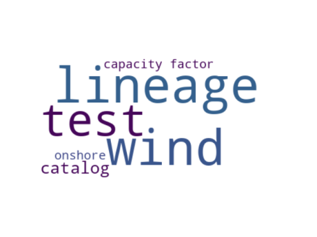

test data catalog
=================

# Description

This is a data catalog to test different functions of the SimpleMDDataCatalog project
## Publisher
  
SimpleMDDataCatalog
## License
  
cc-by-sa 4.0
## keywords

||
| :--- |
|[test](iu34jkAWD.md)|

# Datasets organized by theme
  
the word cloud gives a sense of the themes that are covered by the datasets in this data catalog.  
  
Here you will find datasets organized by theme. The headers of each theme are links you can click to learn more about the definition
## theme: [capacity factor](973I.md)
  
[existing wind on-shore](ewrcqwfeb.md)
## theme: [onshore](weruEF8.md)
  
[existing wind on-shore](ewrcqwfeb.md)
## theme: [wind](fajfafl.md)
  
[tst data](dsdfadf.md)  
[existing wind on-shore](ewrcqwfeb.md)
## theme: [lineage](fdcshjnfdscahjn.md)
  
[tst data](dsdfadf.md)  
[derived data](73956.md)
## theme: [test](iu34jkAWD.md)
  
[test data catalog](None.md)  
[test data](12345.md)
## theme: [catalog](sdfjlhgfvrkhlsfd.md)
  
[test data](12345.md)  
[derived data](73956.md)
## About this catalog
  
This catalog was generated using the SimpleMDDataCatalog package that is is maintained [here](https://github.com/uuidea/SimpleMDDataCatalog).