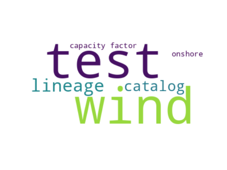

test data catalog
=================

Table of contents
=================

* [Description](#description)
	* [Publisher](#publisher)
	* [License](#license)
	* [keywords](#keywords)
* [Datasets organized by theme](#datasets-organized-by-theme)
	* [theme: [capacity factor](973I.md)](#theme-capacity-factor973imd)
	* [theme: [onshore](weruEF8.md)](#theme-onshoreweruef8md)
	* [theme: [wind](fajfafl.md)](#theme-windfajfaflmd)
	* [theme: [lineage](fdcshjnfdscahjn.md)](#theme-lineagefdcshjnfdscahjnmd)
	* [theme: [test](iu34jkAWD.md)](#theme-testiu34jkawdmd)
	* [theme: [catalog](sdfjlhgfvrkhlsfd.md)](#theme-catalogsdfjlhgfvrkhlsfdmd)
	* [About this catalog](#about-this-catalog)

# Description

This is a data catalog to test different functions of the SimpleMDDataCatalog project  
[The machine readable version of the catalog (ttl) can be found here.](catalog.ttl)
## Publisher
  
n13b084061b21469a9249684455f5cbc6b2
## License
  
n13b084061b21469a9249684455f5cbc6b1
## keywords

||
| :--- |
|[test](iu34jkAWD.md)|

# Datasets organized by theme
  
the word cloud gives a sense of the themes that are covered by the datasets in this data catalog.  
  
Here you will find datasets organized by theme. The headers of each theme are links you can click to learn more about the definition
## theme: [capacity factor](973I.md)
  
[existing wind on-shore](ewrcqwfeb.md)
## theme: [onshore](weruEF8.md)
  
[existing wind on-shore](ewrcqwfeb.md)
## theme: [wind](fajfafl.md)
  
[tst data](dsdfadf.md)  
[existing wind on-shore](ewrcqwfeb.md)
## theme: [lineage](fdcshjnfdscahjn.md)
  
[tst data](dsdfadf.md)  
[derived data](73956.md)
## theme: [test](iu34jkAWD.md)
  
[test data catalog](None.md)  
[test data](12345.md)
## theme: [catalog](sdfjlhgfvrkhlsfd.md)
  
[test data](12345.md)  
[derived data](73956.md)
## About this catalog
  
This catalog was generated using the SimpleMDDataCatalog package that is is maintained [here](https://github.com/uuidea/SimpleMDDataCatalog).