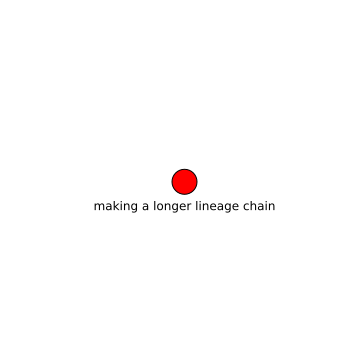

making a longer lineage chain
=============================

# description
  
lineage chain
## keywords

||
| :--- |
|[wind](fajfafl.md)|
|[test](iu34jkAWD.md)|

## Publisher

|||
| :--- | :--- |
|Publisher|SimpleMDDataCatalog|
|Contact|example.example.com|

## About the data

|||
| :--- | :--- |
|last modified|unknown|
|spatial cover|unknown|
|temporal cover|unknown - unknown|
|version|None|

## Data lineage

|was derived from|
| :--- |
|no lineage information available|
  

## License

cc-by 4.0
## Distributions

|identifier|format|version|last modified|access url|
| :---: | :---: | :---: | :---: | :---: |

## Data Quality

|metric|value|time of evaluation|dimension|
| :---: | :---: | :---: | :---: |
